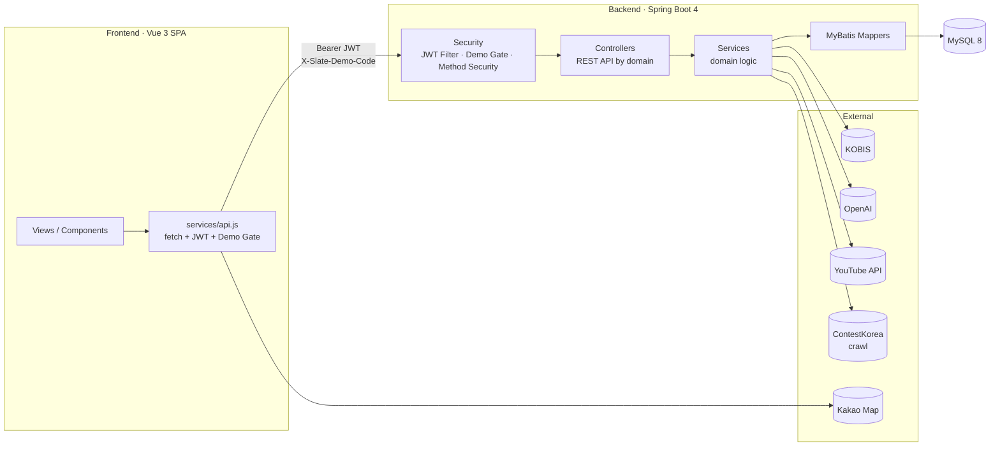
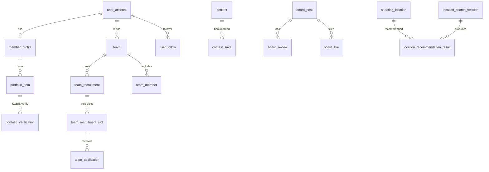

<div align="center">


# Slate

**A portfolio · team-matching · contest platform for the film & creative industry**

Verify actors', directors', and crews' credits against KOBIS public data,
and connect team matching · contests · community · **AI location recommendation** in one place.


[한국어](README.md) · **English**

</div>

---

## 📖 Overview

Film and video production still runs on personal networks for **proving experience**
and **assembling teams**, making it hard for newcomers and freelancers to showcase
verified credits or find the right team.

**Slate** solves this on three axes.

- **Verified portfolios** — user-entered credits are cross-checked against KOBIS (Korean Film Council) data to award a `VERIFIED` badge. Not self-claims, but **public-data-backed proof**.
- **Two-way matching** — leaders find members and members find teams by role/genre/region, combining a weighted scoring policy with OpenAI-based AI recommendations.
- **Creative ecosystem** — contests (self-hosted / crawled), a works board with rankings, follows, AI location recommendation, and company/admin operations, all connected into one service.

**Target users**: creators (actors · directors · crew) · production companies (company accounts) · operations admins.

## ✨ Key Features

| Domain | Features |
|---|---|
| **Accounts · Auth** | User/company/admin accounts, JWT auth, company document approval, demo access gate |
| **Profile · Portfolio** | Role/genre/region profiles, credit entry, **automatic KOBIS credit verification (VERIFIED)**, public profiles |
| **Teams · Recruitment** | Team lifecycle (create·transfer·close·reopen), role-slot recruitment, applications/invitations, team plans |
| **Matching** | Two-way team↔member recommendations, **versioned scoring policy** (preview·rollback), **OpenAI AI recommendations** |
| **Contests** | OPEN list · deadline-soon, structured search, fit analysis, submission prep, **ContestKorea crawler** |
| **Boards · Works** | Works/free boards, reviews·likes, weekly/monthly/all-time rankings, YouTube integration, file streaming |
| **Follows** | Follow/unfollow, followers·following, dashboards |
| **Location recommendation** | **AI location suggestions** from filming-history CSV + Kakao Map visualization |
| **Operations · Admin** | Admin board, reports·sanctions, notifications (templates·batches), audit/operation logs, permission management |

## 🖼️ Preview

> Role-based home dashboards (guest / user / company / admin)

<div align="center">


</div>

## 🛠️ Tech Stack

| Layer | Technology |
|---|---|
| **Backend** | Java 17 · Spring Boot 4.0 · Spring MVC · Spring Security (JWT) · MyBatis 4 |
| **Database** | MySQL 8 (InnoDB, utf8mb4) · ~59 tables |
| **Frontend** | Vue 3.5 · Vite 8 · Vue Router 4 · hand-rolled `fetch` API client |
| **Integrations** | KOBIS (credit verification) · YouTube Data API · OpenAI (AI recs) · Kakao Map · jsoup (crawler) · Apache Commons CSV (importer) |
| **Build** | Maven (backend) · npm/Vite (frontend) |

## 🏗️ Architecture



Layers: **Controller → Service → MyBatis Mapper → MySQL**. Every request passes the JWT filter and the demo access gate (`X-Slate-Demo-Code`); domain services call external APIs (KOBIS·OpenAI·YouTube·crawler).

## 🗃️ Data Model

~59 tables grouped by domain. Core relationships:



| Domain | Key tables |
|---|---|
| Accounts | `user_account`, `company_application`, `admin_permission`, `demo_access_code`, `user_sanction` |
| Profiles | `member_profile`, `portfolio_item`, `portfolio_verification`, `profile_role`, `profile_genre` |
| Teams/Matching | `team`, `team_recruitment(_slot)`, `team_application`, `team_invitation`, `matching_score_policy(_item/_history)` |
| Boards | `board_post`, `board_review`, `board_like`, `work_item`, `file_metadata` |
| Contests | `contest`, `contest_open_request`, `contest_save`, `contest_fit_cache` |
| Locations | `shooting_location(_history)`, `location_search_session`, `location_recommendation_result` |
| Operations | `notification(_template/_delivery_batch)`, `audit_log`, `operation_log` |

Full schema: [`sql/`](sql/) · details: [`docs/API.md`](docs/API.md)

## 💡 Engineering Highlights

- **KOBIS credit verification** — cross-checks entered credits against the KOBIS Open API, normalizing Korean crew role names into role groups (`KobisRoleMatcher`) to decide `VERIFIED` / `AMBIGUOUS` / `NOT_VERIFIED`, then records an audit trail.
- **Hand-rolled JWT security** — HS256 implemented directly (`JwtService`), `@EnableMethodSecurity`, config-driven CORS. The JWT filter cross-checks `ModerationService` to block sanctioned users.
- **ContestKorea crawler** — jsoup-based multi-stage pipeline (DETAIL_FETCH → PARSE → CONTENT_FILTER → NORMALIZE → UPSERT), keyword-filtering to film/video contests before upsert.
- **AI location / matching recommendations** — feeds real DB candidates + user conditions to OpenAI, returning ranked results with reasons/summaries and persisting sessions/results.
- **File upload security** — 5 MB cap + extension/content-type allowlist + **magic-byte signature check** to reject spoofed files.
- **Versioned matching score policy** — weighted policies managed via preview → publish → history → rollback.
- **CSV location importer** — explicit charset decoding, dry-run/chunk options, row-count validation before batch insert.

## 📂 Project Structure

```
.
├── backend/        Spring Boot API (com.slate.{accounts,profiles,teams,matching,
│                     boards,contests,follows,media,locations,admin,moderation,
│                     notifications,references,operations,security,common})
├── frontend/       Vue 3 SPA (views · components · router · services · layouts)
├── sql/            schema · seed SQL
├── assets/         demo seed data (samples only — see assets/README.md)
├── design/         screen design (light/dark theme components)
├── docu/           project baseline docs (requirements·architecture·review·deploy)
├── docs/           portfolio docs (API reference, etc.)
├── tools/          helper scripts
└── Agent.md · EC2_*.md   work baseline · deployment ops guide
```

## 🚀 Getting Started

### Prerequisites
- JDK 17 · Maven
- Node ≥ 20.19
- MySQL 8 (DB `slate`)

### Backend
```bash
cd backend
cp .env.example .env          # fill DB · JWT · external API keys
# inject .env values as environment variables, then
mvn spring-boot:run           # profile: local
```
Schema/seed in [`sql/`](sql/). Enable the location importer with `SLATE_LOCATION_IMPORT_ENABLED=true`.

### Frontend
```bash
cd frontend
cp .env.example .env
npm install
npm run dev                   # http://localhost:5174
```

> No real secrets (DB password, JWT secret, KOBIS/YouTube/OpenAI/Kakao keys) live in this repo; inject them via local environment variables or a deployment secret manager. Every `.env.example` holds only `CHANGE_ME` placeholders.

## 📚 Documentation

- [API Reference](docs/API.md) — full endpoints by domain
- [`assets/README.md`](assets/README.md) — seed data and excluded GIS source data
- [`docu/`](docu/) — requirements·architecture·DB·deployment baselines

## ℹ️ Project Info

Built as an SSAFY common (capstone) project. The MVP is based on `prototype_3`.
Real secrets, operational values, and large raw datasets are excluded for public release.
Licensed under the [MIT License](LICENSE).
