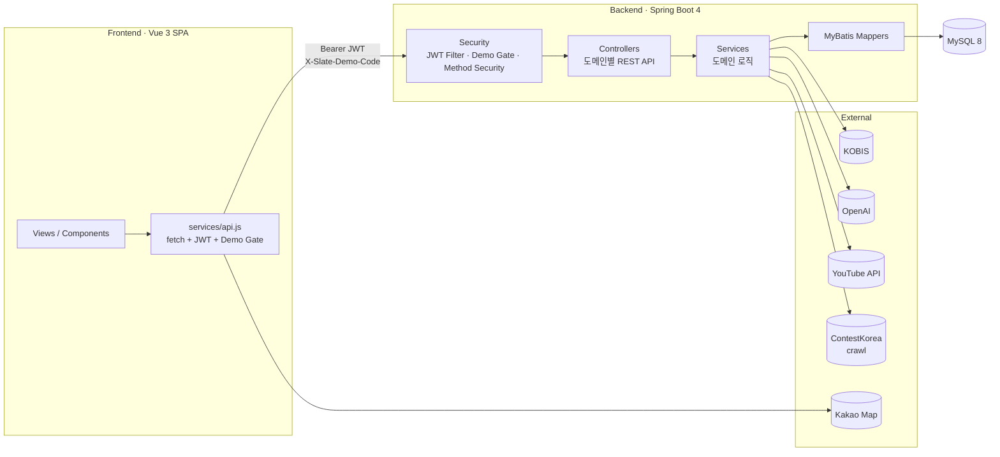
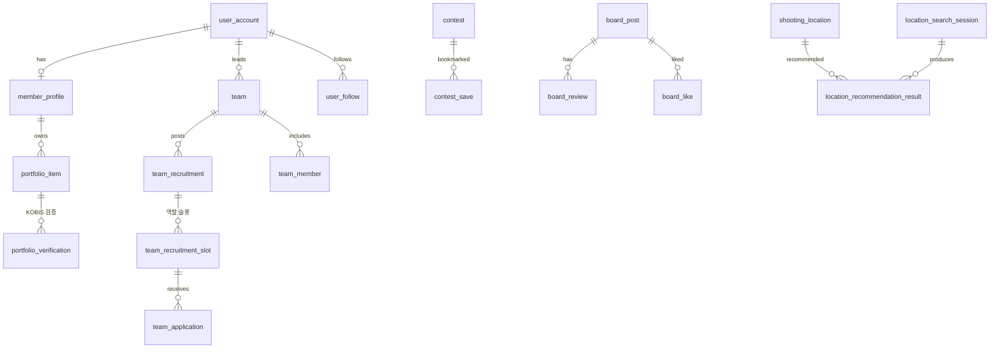

<div align="center">


# Slate

**영화·창작 산업 종사자를 위한 포트폴리오 · 팀 매칭 · 공모전 플랫폼**

배우·감독·스태프의 참여작(크레딧)을 KOBIS 공공데이터로 **검증**하고,
팀 매칭 · 공모전 · 커뮤니티 · **AI 촬영지 추천**까지 한 곳에서 잇는다.


</div>

---

## 📖 서비스 소개

영화·영상 제작 현장은 **경력 증명**과 **인력·팀 구성**이 인맥 중심으로 이뤄져,
신인·프리랜서가 검증된 경력을 보여주거나 맞는 팀을 찾기 어렵다.

**Slate**는 이 문제를 세 축으로 푼다.

- **검증된 포트폴리오** — 사용자가 입력한 참여작을 KOBIS(영화진흥위원회) 크레딧 데이터와 대조해 `VERIFIED` 배지를 부여한다. 자기 주장이 아닌 **공공데이터 기반 증명**.
- **양방향 매칭** — 팀장은 팀원을, 팀원은 팀을 역할·장르·지역 기준으로 추천받고, 가중치 정책 + OpenAI 기반 AI 추천을 함께 사용한다.
- **창작 생태계** — 공모전(자체/외부 크롤링), 작업물 게시판·랭킹, 팔로우, AI 촬영지 추천, 회사·관리자 운영까지 하나의 서비스로 연결한다.

**대상 사용자**: 일반 제작자(배우·감독·스태프) · 제작사(회사 계정) · 운영 관리자.

## ✨ 핵심 기능

| 도메인 | 기능 |
|---|---|
| **계정 · 인증** | 사용자/회사/관리자 계정, JWT 인증·인가, 회사 서류 승인, 데모 접근 게이트 |
| **프로필 · 포트폴리오** | 역할·장르·지역 프로필, 참여작 등록, **KOBIS 크레딧 자동 검증(VERIFIED)**, 공개 프로필 |
| **팀 · 모집** | 팀 생명주기(생성·양도·종료·재개), 역할 슬롯 모집, 지원/초대, 팀 일정 관리 |
| **매칭** | 팀↔팀원 양방향 추천, **버전 관리형 점수 정책**(미리보기·롤백), **OpenAI AI 추천** |
| **공모전** | OPEN 목록·마감 임박, 구조화 검색, 적합도 분석, 제출 준비, **콘테스트코리아 크롤러** |
| **게시판 · 작업물** | 작업물/자유 게시판, 리뷰·좋아요, 주간/월간/전체 랭킹, YouTube 연동, 파일 스트리밍 |
| **팔로우** | 팔로우/언팔로우, 팔로워·팔로잉, 대시보드 |
| **촬영지 추천** | 영화 로케이션 촬영 이력(CSV) 기반 **AI 촬영지 추천** + Kakao Map 시각화 |
| **운영 · 관리** | 관리자 보드, 신고·제재, 알림 발송(템플릿·배치), 감사/운영 로그, 권한 관리 |

## 🖼️ 미리보기

> 역할별 홈 대시보드 UI (게스트 / 사용자 / 회사 / 관리자)

<div align="center">


</div>

## 🛠️ 기술 스택

| 구분 | 기술 |
|---|---|
| **Backend** | Java 17 · Spring Boot 4.0 · Spring MVC · Spring Security(JWT) · MyBatis 4 |
| **Database** | MySQL 8 (InnoDB, utf8mb4) · ~59 tables |
| **Frontend** | Vue 3.5 · Vite 8 · Vue Router 4 · 순수 `fetch` API 클라이언트 |
| **외부 연동** | KOBIS(크레딧 검증) · YouTube Data API · OpenAI(AI 추천) · Kakao Map · jsoup(크롤러) · Apache Commons CSV(임포터) |
| **Build** | Maven (backend) · npm/Vite (frontend) |

## 🏗️ 아키텍처



계층: **Controller → Service → MyBatis Mapper → MySQL**. 모든 요청은 JWT 필터와 데모 접근 게이트(`X-Slate-Demo-Code`)를 통과하며, 도메인 서비스가 외부 API(KOBIS·OpenAI·YouTube·크롤러)를 호출한다.

## 🗃️ 데이터 모델

도메인별로 그룹핑된 약 59개 테이블. 핵심 관계는 다음과 같다.



| 도메인 | 주요 테이블 |
|---|---|
| 계정/권한 | `user_account`, `company_application`, `admin_permission`, `demo_access_code`, `user_sanction` |
| 프로필 | `member_profile`, `portfolio_item`, `portfolio_verification`, `profile_role`, `profile_genre` |
| 팀/매칭 | `team`, `team_recruitment(_slot)`, `team_application`, `team_invitation`, `matching_score_policy(_item/_history)` |
| 게시판 | `board_post`, `board_review`, `board_like`, `work_item`, `file_metadata` |
| 공모전 | `contest`, `contest_open_request`, `contest_save`, `contest_fit_cache` |
| 촬영지 | `shooting_location(_history)`, `location_search_session`, `location_recommendation_result` |
| 운영 | `notification(_template/_delivery_batch)`, `audit_log`, `operation_log` |

전체 스키마: [`sql/`](sql/) · 상세 설명: [`docs/API.md`](docs/API.md)

## 💡 주요 기술 포인트

포트폴리오 관점에서 눈여겨볼 구현.

- **KOBIS 크레딧 검증** — 사용자가 입력한 참여작을 KOBIS Open API 크레딧과 대조. 한국어 스태프 역할명을 역할 그룹으로 정규화(`KobisRoleMatcher`)해 `VERIFIED` / `AMBIGUOUS` / `NOT_VERIFIED` 판정 후 검증 이력 기록.
- **자체 JWT 보안** — HS256 직접 구현(`JwtService`), `@EnableMethodSecurity`, 설정 기반 CORS. JWT 필터가 제재 사용자(`ModerationService`)를 교차 확인해 차단.
- **콘테스트코리아 크롤러** — jsoup 기반 다단계 파이프라인(DETAIL_FETCH → PARSE → CONTENT_FILTER → NORMALIZE → UPSERT). 영화·영상 공모전만 키워드 필터링 후 upsert.
- **AI 촬영지/매칭 추천** — 실제 DB 후보 + 사용자 조건을 OpenAI에 전달해 근거·요약이 붙은 랭킹 결과를 반환, 세션·결과를 영속화.
- **파일 업로드 보안** — 5MB 제한 + 확장자·Content-Type 허용목록 + **매직바이트 시그니처 검사**로 위장 파일 차단.
- **버전 관리형 매칭 점수 정책** — 가중치 정책을 미리보기 → 발행 → 이력 → 롤백으로 관리.
- **CSV 로케이션 임포터** — 문자셋 지정 디코딩, dry-run·청크 옵션, 행 수 검증 후 배치 insert.

## 📂 프로젝트 구조

```
.
├── backend/        Spring Boot API (com.slate.{accounts,profiles,teams,matching,
│                     boards,contests,follows,media,locations,admin,moderation,
│                     notifications,references,operations,security,common})
├── frontend/       Vue 3 SPA (views · components · router · services · layouts)
├── sql/            스키마 · 시드 SQL
├── assets/         데모 시드 데이터 (샘플만 — assets/README.md 참고)
├── design/         화면 설계 (라이트/다크 테마 컴포넌트)
├── docu/           프로젝트 기준 문서 (요구사항·아키텍처·리뷰·배포)
├── docs/           포트폴리오용 문서 (API 레퍼런스 등)
├── tools/          보조 스크립트
└── Agent.md · EC2_*.md   작업 기준 · 배포 운영 가이드
```

## 🚀 실행 방법

### 사전 준비
- JDK 17 · Maven
- Node ≥ 20.19
- MySQL 8 (DB명 `slate`)

### Backend
```bash
cd backend
cp .env.example .env          # DB · JWT · 외부 API 키 값 채우기
# .env 값을 환경변수로 주입 후
mvn spring-boot:run           # profile: local
```
스키마·시드는 [`sql/`](sql/) 참고. 로케이션 임포터는 `SLATE_LOCATION_IMPORT_ENABLED=true`로 활성화.

### Frontend
```bash
cd frontend
cp .env.example .env
npm install
npm run dev                   # http://localhost:5174
```

> 실제 시크릿(DB 비밀번호, JWT secret, KOBIS/YouTube/OpenAI/Kakao 키)은 저장소에 없으며, 로컬 환경변수 또는 배포 secret manager로만 주입한다. 모든 `.env.example`은 `CHANGE_ME` 예시만 담는다.

## 📚 문서

- [API 레퍼런스](docs/API.md) — 도메인별 전체 엔드포인트
- [`assets/README.md`](assets/README.md) — 시드 데이터·제외한 GIS 원본 출처
- [`docu/`](docu/) — 요구사항·아키텍처·DB·배포 기준 문서

## ℹ️ 프로젝트 정보

SSAFY 공통(관통) 프로젝트 결과물. MVP는 `prototype_3` 기준으로 제작했다.
공개용으로 실제 시크릿·운영 값·대용량 원본 데이터는 저장소에서 제외했다.
